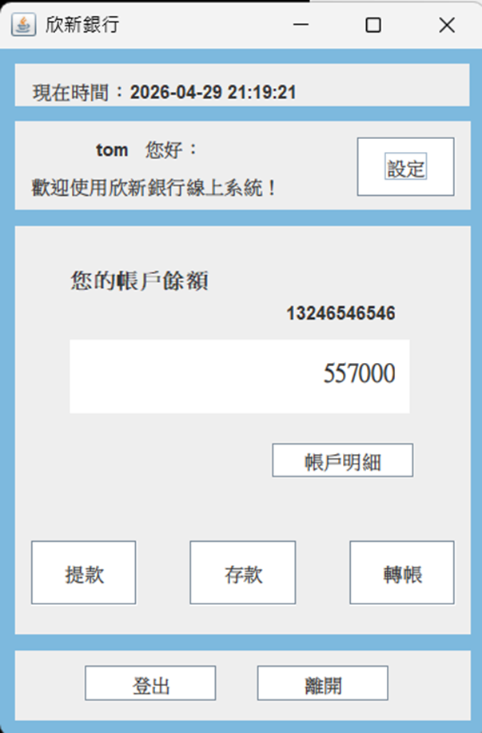
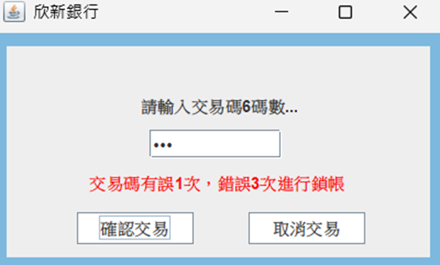

# 欣新銀行 ATM 與後台管理系統

> 本專案是一套以 **Java Swing + Maven + JDBC + MySQL** 開發的桌面型銀行模擬系統，完整實作 ATM 使用者交易流程與後台管理功能。系統採用 **Controller / Service / DAO / Model 分層架構**，將畫面操作、商業邏輯、資料存取與資料模型拆分，展現 Java 桌面應用程式、資料庫操作、交易流程設計與後台管理功能的整合開發能力。

---

## 專案定位

本作品以「銀行 ATM 與後台管理」為情境，模擬真實金融系統中常見的雙角色操作流程：一般使用者可登入 ATM 進行查詢、提款、存款、轉帳與交易明細查詢；管理員則可進入後台維護帳戶資料、查詢帳戶與交易紀錄。

此專案不僅是單一 GUI 程式，而是以完整系統的角度進行設計，包含：

- 使用者端與管理員端的權限分流
- 帳戶資料、管理員資料、交易類型與交易明細的資料庫設計
- 交易流程中的格式驗證、餘額檢查與資料異動
- DAO / Service 分層，避免將 SQL 與商業邏輯混雜在畫面事件中
- 轉帳時同步處理轉出方與轉入方交易紀錄，保留完整交易軌跡

---

## 技術亮點

| 類別 | 說明 |
|---|---|
| **Java Swing GUI** | 使用 Swing 製作登入頁、ATM 操作頁、後台管理頁與交易查詢畫面，具備完整桌面應用操作流程。 |
| **Maven 專案管理** | 使用 Maven 管理專案結構與外部套件，提升專案可建置性與維護性。 |
| **MySQL / JDBC** | 透過 JDBC 串接 MySQL，使用 DAO 封裝資料新增、查詢、修改與刪除邏輯。 |
| **分層架構設計** | 採 Controller / Service / DAO / Model 架構，讓 UI、商業邏輯與資料存取各自負責明確職責。 |
| **雙角色系統** | 區分 ATM 使用者端與後台管理員端，呈現權限分流與不同操作情境。 |
| **交易流程驗證** | 提款、存款、轉帳皆包含金額、帳戶、交易密碼與餘額檢查，避免不合理交易。 |
| **交易明細追蹤** | 每筆提款、存款、轉出、轉入皆會建立交易紀錄，方便使用者與管理端查詢。 |
| **轉帳雙向紀錄** | 轉帳時同時建立轉出方支出紀錄與轉入方收入紀錄，使雙方帳戶都具備完整明細。 |

---

## 系統功能

### 使用者端 ATM 功能

| 功能 | 說明 |
|---|---|
| 使用者登入 | 使用線上帳號與密碼登入 ATM 系統。 |
| 查詢餘額 | 顯示目前帳戶餘額。 |
| 提款 | 驗證金額與餘額後扣款，並新增交易明細。 |
| 存款 | 驗證金額後增加帳戶餘額，並新增交易明細。 |
| 轉帳 | 驗證轉入帳號、金額與餘額後，同步異動雙方帳戶。 |
| 修改密碼 | 使用者可修改線上登入密碼。 |
| 查詢交易明細 | 查詢個人提款、存款、轉出、轉入紀錄。 |

### 管理員後台功能

| 功能 | 說明 |
|---|---|
| 管理員登入 | 管理員或行政人員可登入後台系統。 |
| 新增帳戶 | 建立新銀行帳戶，並檢查交易密碼、身分證、手機與初始存款格式。 |
| 修改帳戶資料 | 維護使用者姓名、地址、電話、密碼等資料。 |
| 刪除帳戶 | 依銀行帳號刪除指定帳戶。 |
| 查詢帳戶資料 | 查詢所有帳戶或指定帳戶資料。 |
| 查詢交易紀錄 | 後台可檢視交易明細，協助管理與追蹤。 |

---

## 系統畫面展示

以下截圖呈現使用者端 ATM 的主要操作情境，圖片以輔助說明為主，README 仍以系統設計與技術實作說明為核心。

| ATM 使用者首頁與帳戶餘額 | 交易密碼驗證流程 |
|---|---|
|  |  |

**畫面說明**

- **ATM 使用者首頁**：登入後顯示目前時間、使用者名稱、銀行帳號與帳戶餘額，並提供提款、存款、轉帳、帳戶明細與設定等主要操作入口。
- **交易密碼驗證**：提款、存款或轉帳等交易前，系統要求輸入 6 位數交易密碼，並限制錯誤次數，以模擬金融交易中的二次驗證流程。

---

## 系統架構

本專案採用分層式架構，降低 GUI 與資料庫操作之間的耦合，讓各層職責更清楚。

```text
Swing UI / Controller
        ↓
Service 商業邏輯層
        ↓
DAO 資料存取層
        ↓
MySQL Database
```

| 層級 | 職責 |
|---|---|
| Controller | 負責 Swing 畫面呈現、按鈕事件、頁面切換與使用者互動。 |
| Service | 負責帳戶驗證、交易規則、餘額異動、帳戶管理等商業邏輯。 |
| DAO | 負責 SQL 指令、JDBC 連線與資料庫 CRUD 操作。 |
| Model | 對應系統主要資料物件，例如帳戶、管理員、交易明細。 |
| Util | 提供資料庫連線、格式處理、表格模型與共用工具。 |

---

## 專案結構

```text
ATM-system/
├─ atm_system/
│  ├─ src/main/java/
│  │  ├─ controller/          # Swing UI 與畫面流程控制
│  │  │  ├─ account/          # 使用者端 ATM 操作畫面
│  │  │  └─ admin/            # 管理員後台畫面
│  │  ├─ dao/                 # DAO 介面
│  │  ├─ dao/Impl/            # JDBC 資料存取實作
│  │  ├─ exception/           # 自訂例外
│  │  ├─ model/               # Account、Administrator、TransactionDetail
│  │  ├─ service/             # Service 介面
│  │  ├─ service/Impl/        # 商業邏輯實作
│  │  ├─ util/                # DB 連線、格式工具、TableModel
│  │  └─ vo/                  # 查詢檢視資料物件
│  ├─ pom.xml
│  ├─ account.txt             # 系統流程暫存檔
│  ├─ admin.txt               # 系統流程暫存檔
│  ├─ Detail.txt              # 系統流程暫存檔
│  └─ Trade.txt               # 交易類型暫存檔
├─ atm_system.sql             # MySQL 建表與測試資料
└─ 欣新銀行ATM與後台系統.jar
```

---

## 資料庫設計

| 資料表 | 說明 |
|---|---|
| `account` | 儲存使用者銀行帳戶、登入帳密、交易密碼、餘額與基本資料。 |
| `administrator` | 儲存後台管理員帳號、密碼與權限等級。 |
| `access` | 定義權限等級，例如管理者、行政人員、客戶端、鎖定帳號。 |
| `tradeact` | 定義交易類型，例如提款、存款、轉出、轉入。 |
| `transaction_detail` | 儲存每筆交易明細，包含收入、支出、交易後餘額、對象帳號與交易時間。 |
| `view01` | 整合交易明細與交易類型，用於更友善地顯示交易紀錄。 |

---

## 核心流程設計

### 1. 帳戶新增驗證

管理員新增帳戶時，Service 層會進行多項資料檢查：

- 交易密碼需為 6 位數字
- 銀行帳號不可重複
- 身分證格式需符合大寫英文字母 + 9 碼數字
- 手機需符合 `09` 開頭共 10 碼
- 初始存款需至少 1000 元

### 2. 提款與存款流程

提款時會先檢查輸入金額是否合法，再確認帳戶餘額是否足夠；存款時則檢查金額是否大於 0。交易成功後，系統會同步更新帳戶餘額並新增交易明細，確保餘額異動有紀錄可追蹤。

### 3. 轉帳流程

轉帳功能會依序檢查轉入帳號、轉帳金額與轉出方餘額。交易成立後，系統會同時異動雙方帳戶，並建立兩筆交易明細：

```text
A 帳戶轉帳給 B 帳戶

A：新增「轉出」支出紀錄，餘額扣款
B：新增「轉入」收入紀錄，餘額增加
```

此設計讓轉出方與轉入方皆能查詢到完整交易紀錄，較貼近實際銀行交易明細邏輯。

### 4. 交易明細查詢

系統將交易資料集中儲存在 `transaction_detail`，並透過 `view01` 整合交易類型，使畫面顯示時能以較直覺的方式呈現交易方向與交易內容。

---

## 建置與執行

### 1. 匯入資料庫

請先於 MySQL 匯入專案根目錄的 `atm_system.sql`：

```sql
SOURCE /path/to/atm_system.sql;
```

或使用 MySQL Workbench 開啟 `atm_system.sql` 後執行。

### 2. 檢查資料庫連線設定

資料庫連線位置位於：

```text
atm_system/src/main/java/util/Tool.java
```

請依本機 MySQL 設定調整：

```java
String sql = "jdbc:mysql://localhost:3306/atm_system";
String user = "root";
String password = "你的MySQL密碼";
```

### 3. 使用 Maven 建置

```bash
cd atm_system
mvn clean package
```

### 4. 執行專案

可使用 Eclipse 執行登入畫面主程式，或執行已打包的 JAR：

```bash
java -jar 欣新銀行ATM與後台系統.jar
```

---

## 測試帳號

可使用 `atm_system.sql` 內建測試資料登入。

### 管理員帳號

| 身分 | 帳號 | 密碼 |
|---|---|---|
| 管理者 | root | 1234 |
| 行政人員 | admin | 0000 |

### 使用者帳號範例

| 使用者 | 線上帳號 | 線上密碼 | 銀行帳號 | 交易密碼 |
|---|---|---|---|---|
| Tom | tom | 05145 | 13246546546 | 541234 |
| Yam | yam | 44551 | 88145649511 | 482212 |
| Wendy | wendy | 44410 | 13245646546 | 123456 |

---

## 作品集可展示能力

本作品可作為 Java 桌面應用與資料庫系統開發能力的展示，具體呈現下列能力：

- 能使用 Java Swing 製作具備完整流程的桌面 GUI。
- 能使用 Maven 建立標準 Java 專案結構並管理套件。
- 能使用 JDBC 串接 MySQL，並以 DAO 封裝資料庫存取邏輯。
- 能將系統拆分為 Controller、Service、DAO、Model，具備基礎架構設計能力。
- 能設計帳戶、權限、交易類型與交易明細等資料表。
- 能處理登入、交易驗證、餘額異動、轉帳紀錄與後台管理等商業流程。
- 能將使用者端與管理員端功能分流，呈現角色權限與系統流程規劃能力。

---

## 後續優化方向

| 類別 | 優化方向 |
|---|---|
| 安全性 | 將密碼改為雜湊儲存，例如 BCrypt。 |
| 交易一致性 | 轉帳涉及雙方帳戶異動，後續可加入資料庫 transaction 控制，確保全部成功或全部失敗。 |
| 連線管理 | 可導入 connection pool，集中管理連線生命週期。 |
| UI 維護性 | 可再拆分畫面元件與事件邏輯，降低單一 UI class 複雜度。 |
| 設定管理 | 將 DB 帳號密碼移至 properties 或 config 檔，避免寫死於程式碼。 |
| 權限控管 | 可補強不同 access level 對應的操作限制。 |

---

## 授權

本專案為 Java 學習與作品集展示用途，僅供教學、練習與求職作品參考。
